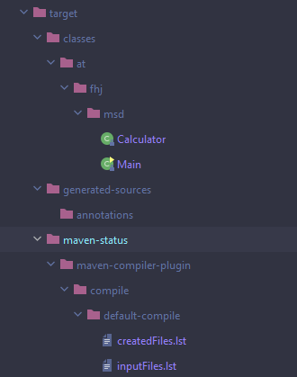
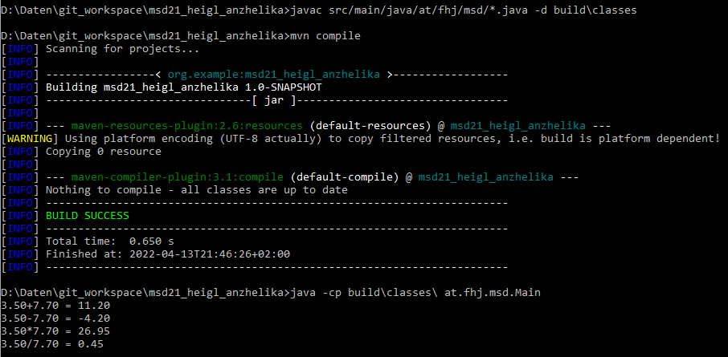

# Exercise 3
## Description
Project Structure and Git

## Path variable

* The PATH is the system variable that the operating system uses to locate needed executables from the command line or Terminal window.
* The PATH system variable can be set using System Utility in control panel on Windows.

More information: https://www.java.com/en/download/help/path.html

Useful commands:
* mvn -v
* javac -version
* java -version

## Maven Project
The Project can be created in IntelliJ (.idea folder is to be added to the gitignore file, Java classes are created in a package at.fhj.msd).

After the project has been run a new folder appears: **target**.
The target folder is the maven default output folder. When a project is build or packaged, all the content of the sources, resources and web files will be put inside of it, it will be used for construct the artifacts and for run tests.

To run the program in the terminal use **mvn compile**

