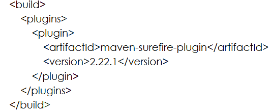
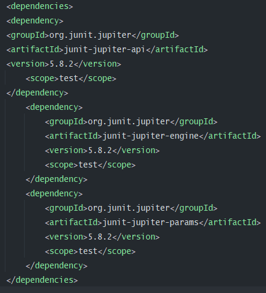
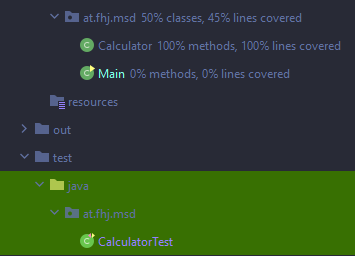

# Exercise 4
## Description
Testing a Java project with JUnit

## Get prepared 

* add **properties** in pom.xml: <project.build.sourceEncoding>UTF-8</project.build.sourceEncoding> (Um keine Warnungen bei
der Ausführung des mvn Kommandos auf der
  Kommandozeile zu erhalten)
* add **build** tags in pom.xml (Damit die Tests auf der Kommandozeile korrekt ausgeführt werden)

* specify **dependencies** in pom.xml (in order to use JUnit in the project)

* apply changes: pom.xml -> Maven -> Reload project

## JUnit tests
A JUnit test is a method contained in a class which is only used for testing.

You can use assert methods, provided by JUnit or another assert framework, to check an expected result versus the actual result. Such statement are called asserts or assert statements.
To mark a method as a test method, annotate it with the @Test annotation. This method executes the code under test.

Assert statements typically allow defining messages which are shown if the test fails. You should provide here meaningful messages to make it easier for the user to identify and fix the problem.

* The method annotated with @BeforeEach runs before each test
* A method annotated with @Test defines a test method
* @DisplayName can be used to define the name of the test which is displayed to the user
* "assertEquals..." is an assert statement which validates that expected and actual value is the same, if not the message at the end of the method is shown
* @RepeatedTest would define that this test method will be executed multiple times

## Assertions and assumptions
JUnit 5 comes with multiple assert statements, which allows you to test your code under test. Simple assert statements like the following allow to check for true, false or equality.
All of them are static methods from the org.junit.jupiter.api.Assertions.* package.

| Assert statement| Example|
| ------ | ------ |
| assertEquals | assertEquals(4, calculator.multiply(15.0, 5),"optional failure message") |
| assertTrue | assertTrue('a' < 'b', () → "optional failure message")|
| assertFalse| assertFalse('a' > 'b', () → "optional failure message") |
| assertNotNull | assertNotNull(yourObject, "optional failure message") |
| assertNull | assertNull(yourObject, "optional failure message") |

More information: https://www.vogella.com/tutorials/JUnit/article.html

## Tests
In the exercise I first use the @BeforeEach method which runs before every test and then run two tests for each method of the Calculator class.
The assertEquals and assertsTrue methods are used to test the results.

* Method 1: Calculator.add
  * 15 + 5 = 20
  * 3 + 18 = 21
* Method 2: Calculator.minus
  * 10.5 - 5.5 = 5
  * 12 - 6 = 6
* Method 3: Calculator.multiply
  * 20.5 * 2 = 41
  * 11 * 6 = 66
* Method 4: Calculator.divide
  * 33 / 11 = 3
  * 110 / 11 = 10

* Method 5: Calculator.factorial
  * 5! = 120
  * 3! = 6
  * 6! = 720

More information on version control: https://istories.media/workshops/2022/02/04/sistema-kontrolya-versii-git-urok-2/

